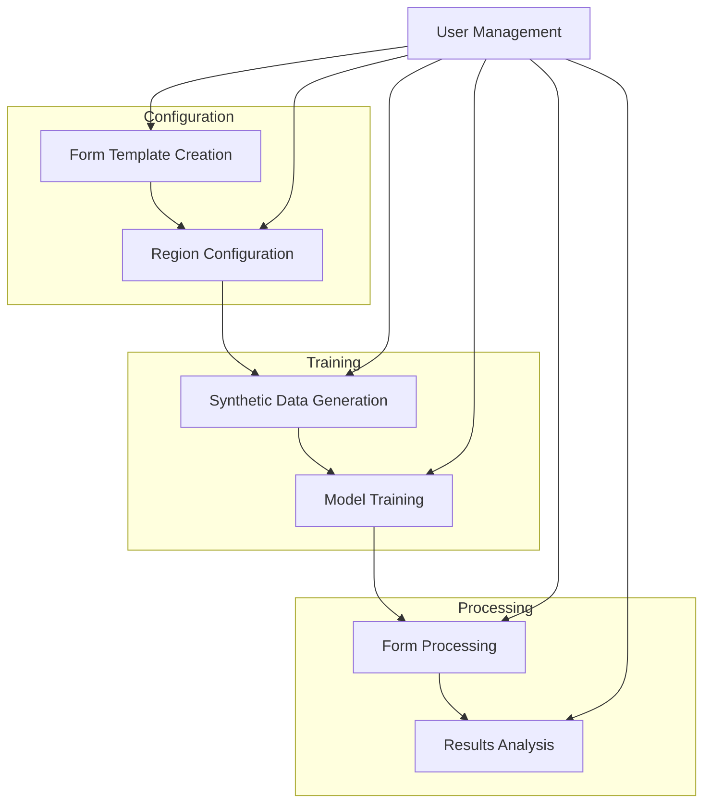
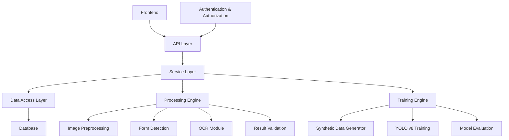
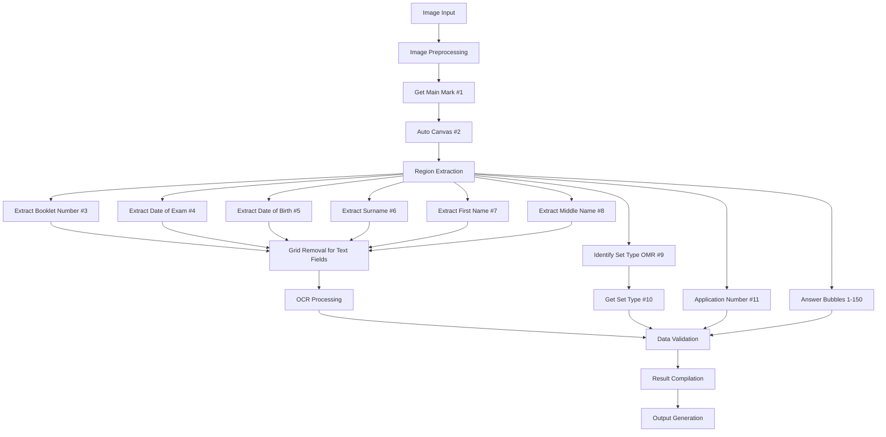
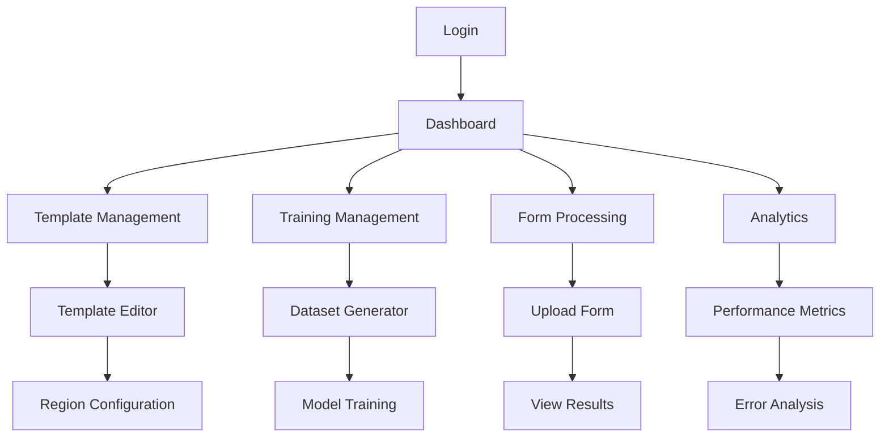
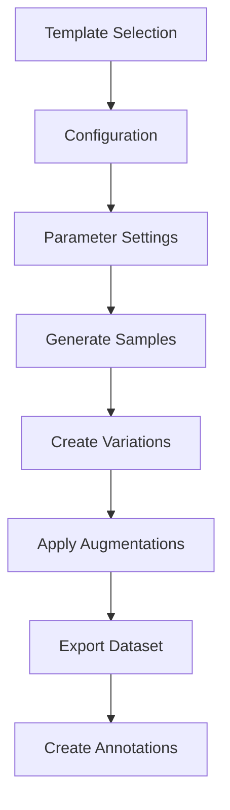
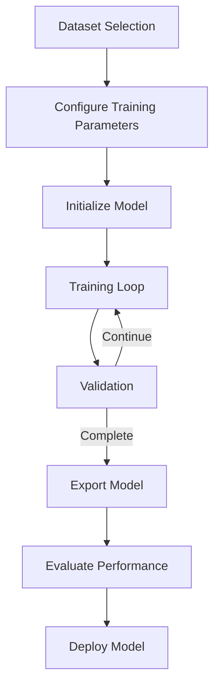
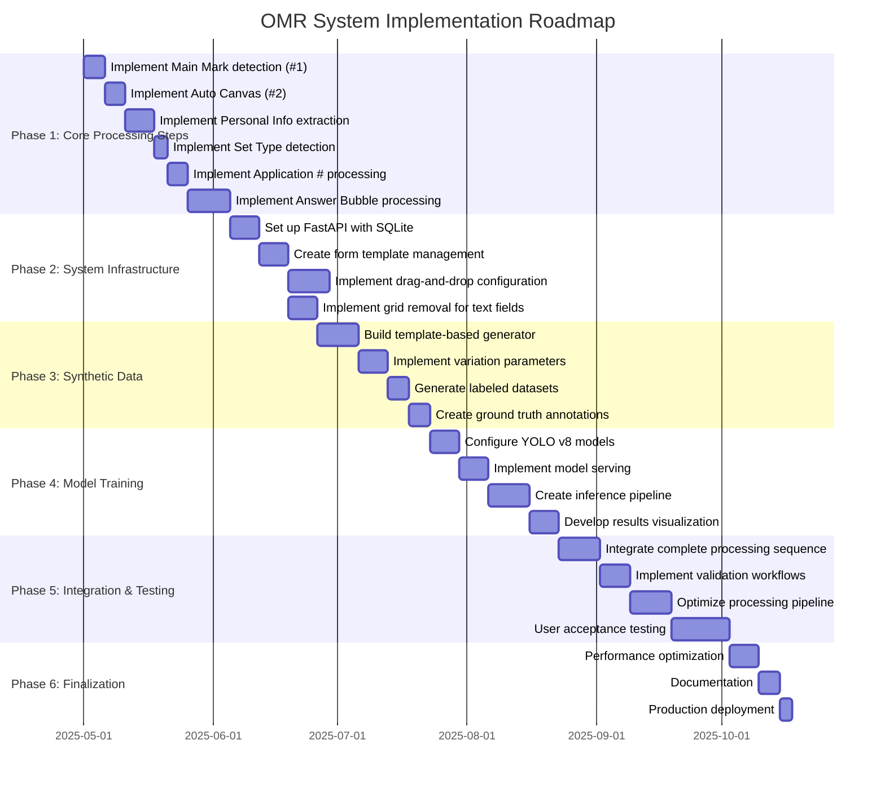

# OMR Form Processing System Documentation

## 1. System Overview

The OMR Form Processing System is designed to automate the extraction and processing of data from National Police Commission examination answer sheets. The system uses computer vision and machine learning techniques to accurately detect and interpret various form elements including application numbers, set types, and answer bubbles.

## 2. Core Processing Steps (Required Sequence)

The system must follow this exact sequence when processing OMR forms:

1. **Get the Main Mark (#1)**
   - Establish the anchor point with 3 lines for alignment
   - Critical first step for proper form positioning
   - This is the only way to compute that has 3 lines that can be the anchor point

2. **Auto Canvas (#2)**
   - Capture canvas size and ensure proper orientation 
   - Use bird's eye view for scanning
   - Maintain EXACT RATIO regardless of form size
   - If scan was tilted, it must be arranged correctly

3. **Extract Personal Information**
   - **Booklet Number (#3)** - 6 digits
   - **Date of Exam (#4)** - 8 digits (mm/dd/yyyy)
   - **Date of Birth (#5)** - 8 digits (mm/dd/yyyy)
   - **Name Fields**:
     - **Surname (#6)** - A-Z or a-z
     - **First Name (#7)** - A-Z or a-z
     - **Middle Name (#8)** - A-Z or a-z
     - Note: Pay attention to spacing between fields

4. **Set Type Processing**
   - **Identify Set Type OMR (#9)** 
   - **Get Set Type (#10)** - Critical as each set (A, B, or C) has different answer sets

5. **Application Number Processing (#11)**
   - Extract all 11 vertical columns (digits 1-0)
   - Plot each column manually (not OCR)
   - Determine which numbers are shaded in each column
   - Concatenate all 11 shaded digits to build the complete Application Number

6. **Answer Bubble Processing**
   - Plot each of the 150 items (1-150) on a blank template
   - For each item, determine which option (1-5) is shaded
   - Process all 5 columns of 30 questions each
   - Plot from right to left (5 items)
   - Note that labels vary from 1-3 characters in length
   - Manual plotting is required for all inputs

### Technical Considerations
- The form is from the National Police Commission examination answer sheet
- All inputs must be plotted manually, not automatically read
- This is the final processing step in the workflow
- Proper alignment is critical for accurate data capture

## 3. System Objectives

- Create a configurable system for processing OMR forms following the required sequence
- Provide a drag-and-drop interface for form template configuration
- Generate synthetic training data for machine learning models
- Train YOLO v8 models to detect form elements
- Process form images with high accuracy
- Extract text fields using OCR with grid line removal
- Save and export processed results

### 3.1 System Flow



## 2. System Architecture (SOLID Design)

### 2.1 Core Components



### 2.2 SOLID Implementation

- **Single Responsibility**: Each module handles one aspect (configuration, detection, training)
- **Open/Closed**: Extensible for new form types without modifying existing code
- **Liskov Substitution**: Common interfaces for different form processors
- **Interface Segregation**: Specialized interfaces for bubble detection vs. text extraction
- **Dependency Inversion**: High-level modules independent of low-level implementation details

## 3. Database Schema (SQLite)

```sql
-- Form Templates
CREATE TABLE form_templates (
    id INTEGER PRIMARY KEY,
    name TEXT NOT NULL,
    description TEXT,
    created_at TIMESTAMP DEFAULT CURRENT_TIMESTAMP
);

-- Form Regions (for drag-drop configuration)
CREATE TABLE form_regions (
    id INTEGER PRIMARY KEY,
    template_id INTEGER REFERENCES form_templates(id),
    region_type TEXT NOT NULL, -- 'application_number', 'answer_bubble', 'text_field', 'set_type'
    x_start INTEGER NOT NULL,
    y_start INTEGER NOT NULL,
    width INTEGER NOT NULL,
    height INTEGER NOT NULL,
    field_name TEXT NOT NULL,
    properties JSON -- Store specific properties for each region type
);

-- Training Data Sets
CREATE TABLE training_datasets (
    id INTEGER PRIMARY KEY,
    template_id INTEGER REFERENCES form_templates(id),
    dataset_name TEXT NOT NULL,
    dataset_path TEXT NOT NULL,
    created_at TIMESTAMP DEFAULT CURRENT_TIMESTAMP
);

-- Trained Models
CREATE TABLE trained_models (
    id INTEGER PRIMARY KEY,
    template_id INTEGER REFERENCES form_templates(id),
    dataset_id INTEGER REFERENCES training_datasets(id),
    model_name TEXT NOT NULL,
    model_path TEXT NOT NULL,
    config_params JSON,
    metrics JSON,
    created_at TIMESTAMP DEFAULT CURRENT_TIMESTAMP
);

-- Processed Forms
CREATE TABLE processed_forms (
    id INTEGER PRIMARY KEY,
    template_id INTEGER REFERENCES form_templates(id),
    model_id INTEGER REFERENCES trained_models(id),
    image_path TEXT NOT NULL,
    extracted_data JSON,
    confidence_score REAL,
    processed_at TIMESTAMP DEFAULT CURRENT_TIMESTAMP
);

-- Users
CREATE TABLE users (
    id INTEGER PRIMARY KEY,
    username TEXT NOT NULL UNIQUE,
    email TEXT NOT NULL UNIQUE,
    hashed_password TEXT NOT NULL,
    is_active BOOLEAN NOT NULL DEFAULT TRUE,
    is_superuser BOOLEAN NOT NULL DEFAULT FALSE,
    created_at TIMESTAMP DEFAULT CURRENT_TIMESTAMP
);

-- User Permissions
CREATE TABLE permissions (
    id INTEGER PRIMARY KEY,
    user_id INTEGER REFERENCES users(id),
    permission_type TEXT NOT NULL,
    created_at TIMESTAMP DEFAULT CURRENT_TIMESTAMP,
    UNIQUE(user_id, permission_type)
);
```

## 4. Form Processing Pipeline

### 4.1 Processing Flow



### 4.2 Image Preprocessing

1. **Acquisition**: Capture high-resolution image of form
2. **Alignment**: Use main mark (#1) with 3 lines as anchor point
3. **Canvas Adjustment**: Apply bird's eye transformation to normalize orientation
4. **Enhancement**:
   - Apply adaptive thresholding to improve contrast
   - Use Gaussian blur to reduce noise
   - Perform histogram equalization for consistent exposure

### 4.3 Region Extraction According to Core Processing Steps

Following the required sequence:

1. **Main Mark Detection (#1)**:
   - Identify the anchor point with 3 lines
   - Use this as the primary reference point for all subsequent operations
   - Critical for establishing the coordinate system

2. **Canvas Adjustment (#2)**:
   - Ensure proper orientation and scaling
   - Apply bird's eye transformation to normalize perspective
   - Maintain exact ratio of the form

3. **Personal Information Extraction (#3-#8)**:
   - Process Booklet Number (6 digits)
   - Process Date of Exam (8 digits, mm/dd/yyyy format)
   - Process Date of Birth (8 digits, mm/dd/yyyy format)
   - Process Name Fields:
     - Surname with attention to spacing
     - First Name with attention to spacing
     - Middle Name with attention to spacing

4. **Set Type Detection (#9-#10)**:
   - Identify the Set Type bubble (A, B, or C)
   - Critical for determining which answer key to use

5. **Application Number Processing (#11)**:
   - Process all 11 vertical columns of digits (0-9)
   - Determine which bubble is filled in each column
   - Concatenate these digits to form the complete application number

6. **Answer Bubble Processing**:
   - Process all 150 questions
   - For each question, determine which of the 5 options is selected
   - Process the 5 columns with 30 questions each
   - Ensure right-to-left processing (5 items)

### 4.4 Data Extraction Techniques

1. **Grid Removal for Text Fields**:
   - Apply morphological operations to isolate and remove grid lines
   - Preserve only handwritten/filled content
   - Apply background subtraction to enhance characters
   
2. **Bubble Detection**:
   - Process each region separately following the exact required sequence
   - Apply contour detection to identify filled bubbles
   - Calculate fill percentage to determine selection threshold
   - Filter based on size and shape constraints

3. **Final Output Generation**:
   - Application Number: Concatenate 11 detected digits
   - Set Type: Identify selected option (A, B, or C)
   - Answer Choices: Map 150 questions to respective chosen options (1-5)
   - Text Fields: Apply OCR on grid-removed regions for personal information

## 5. API Endpoint Specification

### 5.1 Authentication Endpoints

```
POST /api/auth/login
- Purpose: Authenticate user and return JWT token
- Request Body: {username: string, password: string}
- Response: {access_token: string, token_type: string, expires_in: number}
- Status Codes: 200 OK, 401 Unauthorized, 422 Validation Error
```

```
POST /api/auth/refresh
- Purpose: Refresh authentication token
- Headers: Authorization: Bearer {token}
- Response: {access_token: string, token_type: string, expires_in: number}
- Status Codes: 200 OK, 401 Unauthorized
```

### 5.2 Template Management

```
GET /api/templates
- Purpose: List all form templates
- Query Parameters: page: int, limit: int, search: string
- Response: {items: Template[], total: int, page: int, limit: int}
- Status Codes: 200 OK, 401 Unauthorized
```

```
POST /api/templates
- Purpose: Create new form template
- Request Body: {name: string, description: string}
- Response: Template object
- Status Codes: 201 Created, 401 Unauthorized, 422 Validation Error
```

```
GET /api/templates/{template_id}
- Purpose: Get template details
- Path Parameters: template_id: int
- Response: Template object with regions
- Status Codes: 200 OK, 404 Not Found, 401 Unauthorized
```

```
PUT /api/templates/{template_id}
- Purpose: Update template details
- Path Parameters: template_id: int
- Request Body: {name: string, description: string}
- Response: Updated Template object
- Status Codes: 200 OK, 404 Not Found, 401 Unauthorized, 422 Validation Error
```

```
DELETE /api/templates/{template_id}
- Purpose: Delete template
- Path Parameters: template_id: int
- Response: {success: boolean}
- Status Codes: 200 OK, 404 Not Found, 401 Unauthorized
```

### 5.3 Region Configuration

```
GET /api/templates/{template_id}/regions
- Purpose: List all regions for a template
- Path Parameters: template_id: int
- Response: Array of Region objects
- Status Codes: 200 OK, 404 Not Found, 401 Unauthorized
```

```
POST /api/templates/{template_id}/regions
- Purpose: Add new region to template
- Path Parameters: template_id: int
- Request Body: {
    region_type: string,
    x_start: int,
    y_start: int,
    width: int,
    height: int,
    field_name: string,
    properties: object
  }
- Response: Created Region object
- Status Codes: 201 Created, 404 Not Found, 401 Unauthorized, 422 Validation Error
```

```
PUT /api/templates/{template_id}/regions/{region_id}
- Purpose: Update region configuration
- Path Parameters: template_id: int, region_id: int
- Request Body: Region object
- Response: Updated Region object
- Status Codes: 200 OK, 404 Not Found, 401 Unauthorized, 422 Validation Error
```

```
DELETE /api/templates/{template_id}/regions/{region_id}
- Purpose: Delete region
- Path Parameters: template_id: int, region_id: int
- Response: {success: boolean}
- Status Codes: 200 OK, 404 Not Found, 401 Unauthorized
```

### 5.4 Synthetic Data Generation

```
POST /api/training/generate
- Purpose: Generate synthetic training data
- Request Body: {
    template_id: int,
    dataset_name: string,
    num_samples: int,
    variation_params: {
      fill_variations: array,
      mark_variations: array,
      noise_variations: array
    }
  }
- Response: {
    dataset_id: int,
    status: string,
    task_id: string,
    estimated_completion_time: string
  }
- Status Codes: 202 Accepted, 400 Bad Request, 401 Unauthorized, 422 Validation Error
```

```
GET /api/training/datasets
- Purpose: List all training datasets
- Query Parameters: page: int, limit: int, template_id: int
- Response: {items: Dataset[], total: int, page: int, limit: int}
- Status Codes: 200 OK, 401 Unauthorized
```

```
GET /api/training/datasets/{dataset_id}
- Purpose: Get dataset details
- Path Parameters: dataset_id: int
- Response: Dataset object with stats
- Status Codes: 200 OK, 404 Not Found, 401 Unauthorized
```

```
DELETE /api/training/datasets/{dataset_id}
- Purpose: Delete dataset
- Path Parameters: dataset_id: int
- Response: {success: boolean}
- Status Codes: 200 OK, 404 Not Found, 401 Unauthorized
```

### 5.5 Model Training

```
POST /api/training/models
- Purpose: Initialize model training
- Request Body: {
    template_id: int,
    dataset_id: int,
    model_name: string,
    training_params: {
      epochs: int,
      batch_size: int,
      learning_rate: float,
      img_size: int,
      augmentation: object
    }
  }
- Response: {
    model_id: int,
    status: string,
    task_id: string,
    estimated_completion_time: string
  }
- Status Codes: 202 Accepted, 400 Bad Request, 401 Unauthorized, 422 Validation Error
```

```
GET /api/training/models
- Purpose: List all trained models
- Query Parameters: page: int, limit: int, template_id: int
- Response: {items: Model[], total: int, page: int, limit: int}
- Status Codes: 200 OK, 401 Unauthorized
```

```
GET /api/training/models/{model_id}
- Purpose: Get model details and metrics
- Path Parameters: model_id: int
- Response: Model object with metrics and charts
- Status Codes: 200 OK, 404 Not Found, 401 Unauthorized
```

```
GET /api/training/models/{model_id}/status
- Purpose: Check training status
- Path Parameters: model_id: int
- Response: {
    status: string,
    progress: float,
    current_epoch: int,
    total_epochs: int,
    metrics: object,
    eta: string
  }
- Status Codes: 200 OK, 404 Not Found, 401 Unauthorized
```

```
DELETE /api/training/models/{model_id}
- Purpose: Delete model
- Path Parameters: model_id: int
- Response: {success: boolean}
- Status Codes: 200 OK, 404 Not Found, 401 Unauthorized
```

### 5.6 Form Processing

```
POST /api/processing/forms
- Purpose: Process a new form
- Request Body: {
    template_id: int,
    model_id: int,
    image: binary (multipart/form-data)
  }
- Response: {
    form_id: int,
    status: string,
    task_id: string
  }
- Status Codes: 202 Accepted, 400 Bad Request, 401 Unauthorized, 422 Validation Error
```

```
GET /api/processing/forms
- Purpose: List all processed forms
- Query Parameters: page: int, limit: int, template_id: int, status: string, date_from: string, date_to: string
- Response: {items: Form[], total: int, page: int, limit: int}
- Status Codes: 200 OK, 401 Unauthorized
```

```
GET /api/processing/forms/{form_id}
- Purpose: Get processed form details
- Path Parameters: form_id: int
- Response: Form object with extracted data
- Status Codes: 200 OK, 404 Not Found, 401 Unauthorized
```

```
GET /api/processing/forms/{form_id}/download
- Purpose: Download processed form results
- Path Parameters: form_id: int
- Query Parameters: format: string (csv, json, xlsx)
- Response: Binary file
- Status Codes: 200 OK, 404 Not Found, 401 Unauthorized
```

```
DELETE /api/processing/forms/{form_id}
- Purpose: Delete processed form
- Path Parameters: form_id: int
- Response: {success: boolean}
- Status Codes: 200 OK, 404 Not Found, 401 Unauthorized
```

## 6. User Interface Specification

### 6.1 User Journey Flow



### 6.2 Dashboard

```
Component: Dashboard
Purpose: Main entry point providing system overview
Features:
- System status card (processing queue, training jobs)
- Recent forms processed chart (last 7 days)
- Quick stats (total templates, models, accuracy)
- Quick action buttons (new template, process form)
```

### 6.3 Template Management Interface

```
Component: Template List
Purpose: Browse and manage form templates
Features:
- Sortable and filterable table
- Thumbnail preview
- Quick actions (edit, duplicate, delete)
- Import/export template functionality
```

```
Component: Template Editor
Purpose: Create and configure form templates
Features:
- Image upload/preview panel
- Interactive region selection tool
- Region property editor (sidebar)
- Grid/snap alignment guides
- Zoom and pan controls
- Undo/redo functionality
```

```
Component: Region Configuration
Purpose: Configure detection for specific form regions
Features:
- Region type selector (application number, set type, answer bubble, text field)
- Visual boundary editor
- Field mapping configuration
- Validation rules editor
- Test extraction preview
```

### 6.4 Training Interface

```
Component: Dataset Generator
Purpose: Create synthetic training data
Features:
- Template selector
- Sample count control
- Variation parameter sliders
- Preview generated samples
- Progress indicator
- Export controls
```

```
Component: Training Manager
Purpose: Configure and monitor model training
Features:
- Dataset selection
- Training hyperparameter controls
- Real-time training metrics charts
- Model comparison view
- Export/deploy trained model
- Training log viewer
```

```
Component: Model Evaluation
Purpose: Evaluate model performance
Features:
- Confusion matrix visualization
- Precision/recall curves
- Accuracy metrics by class
- Sample predictions browser
- Error analysis tools
```

### 6.5 Form Processing Interface

```
Component: Form Processor
Purpose: Process and validate form submissions
Features:
- Template selection
- Model selection
- Drag-and-drop file upload
- Batch processing support
- Processing queue monitor
- Error correction tools
```

```
Component: Results Viewer
Purpose: View and validate extraction results
Features:
- Side-by-side original/processed view
- Highlighted detections overlay
- Confidence score indicators
- Manual correction tools
- Export results functionality
- Batch approval workflow
```

```
Component: Analytics Dashboard
Purpose: Analyze processing results and trends
Features:
- Processing volume trends
- Accuracy metrics over time
- Error rate by form region
- User productivity metrics
- Export reports functionality
```

### 6.6 Interface Mockups

#### 6.6.1 Template Editor Interface

```
+----------------------------------------------------------+
|  [Logo] OMR Form Processor      [User] [Settings] [Help] |
+----------------------------------------------------------+
| [Templates] [Training] [Processing] [Analytics] [Admin]  |
+----------------------------------------------------------+
|                                  |                       |
| [Upload] [Save] [Test] [Export] | Form Properties       |
|                                  |                       |
| +----------------------------+   | Template Name:        |
| |                            |   | [National Police Exam]|
| |                            |   |                       |
| |      Form Image Preview    |   | Dimensions:          |
| |                            |   | 2550 x 3300 px       |
| |   [Drag regions to define] |   |                       |
| |                            |   | Selected Region:      |
| |                            |   | Application Number    |
| |                            |   |                       |
| |                            |   | Position:            |
| |                            |   | X: 560 Y: 180        |
| |                            |   | W: 320 H: 180        |
| |                            |   |                       |
| |                            |   | Region Type:         |
| |                            |   | [Application Number ▼]|
| |                            |   |                       |
| |                            |   | Properties:          |
| |                            |   | Columns: 11          |
| |                            |   | Digits: 0-9          |
| |                            |   |                       |
| +----------------------------+   | [Apply] [Reset]      |
|                                  |                       |
+----------------------------------+-----------------------+
```

#### 6.6.2 Synthetic Data Generator Interface

```
+----------------------------------------------------------+
|  [Logo] OMR Form Processor      [User] [Settings] [Help] |
+----------------------------------------------------------+
| [Templates] [Training] [Processing] [Analytics] [Admin]  |
+----------------------------------------------------------+
|                                                          |
| Generate Training Data                                   |
|                                                          |
| Template: [National Police Exam ▼]                       |
|                                                          |
| Dataset Name: [NAPOLCOM_Training_Set_003]                |
|                                                          |
| Number of Samples: [5000]                                |
|                                                          |
| +-------------------------------------------+            |
| | Variation Parameters                      |            |
| |                                           |            |
| | Fill Style:     [X] Solid  [X] Hatched   |            |
| |                 [X] Dotted [ ] Custom    |            |
| |                                           |            |
| | Mark Types:     [X] Pencil [X] Pen       |            |
| |                 [X] Marker [ ] Crayon    |            |
| |                                           |            |
| | Environmental:  [X] Paper Texture        |            |
| |                 [X] Smudges              |            |
| |                 [X] Folds                |            |
| |                 [X] Speckles             |            |
| |                                           |            |
| +-------------------------------------------+            |
|                                                          |
| +----------------------+ +------------------------+      |
| | Preview Sample       | | Class Distribution     |      |
| |                      | |                        |      |
| | [Sample image]       | | [Bar chart showing     |      |
| |                      | |  balanced distribution |      |
| |                      | |  across all classes]   |      |
| |                      | |                        |      |
| +----------------------+ +------------------------+      |
|                                                          |
| [Back]                          [Generate Dataset]       |
+----------------------------------------------------------+
```

#### 6.6.3 Form Processing Interface

```
+----------------------------------------------------------+
|  [Logo] OMR Form Processor      [User] [Settings] [Help] |
+----------------------------------------------------------+
| [Templates] [Training] [Processing] [Analytics] [Admin]  |
+----------------------------------------------------------+
|                                                          |
| Process Form                                             |
|                                                          |
| +---------------------------+ +-----------------------+  |
| | Upload                    | | Processing Queue     |  |
| |                           | |                      |  |
| | [Drag files here          | | Active: 2            |  |
| |  or click to upload]      | | Completed: 128       |  |
| |                           | | Failed: 3            |  |
| | Files: 5 selected         | |                      |  |
| | Total Size: 12.8 MB       | | [View Queue]         |  |
| |                           | |                      |  |
| | [Clear] [Upload More]     | +-----------------------+  |
| +---------------------------+                            |
|                                                          |
| Template: [National Police Exam ▼]                       |
| Model:    [NAPOLCOM_Detector_v2 (98.4% accuracy) ▼]      |
|                                                          |
| Processing Options:                                      |
| [X] Auto-rotate and align                                |
| [X] Enhance contrast                                     |
| [X] Apply grid removal for text fields                   |
| [X] Run validation checks                                |
| [ ] Save intermediate processing images                  |
|                                                          |
| Output Format: [CSV ▼]                                   |
|                                                          |
| [Back]                    [Start Processing (5 files)]   |
+----------------------------------------------------------+
```

#### 6.6.4 Results Viewer Interface

```
+----------------------------------------------------------+
|  [Logo] OMR Form Processor      [User] [Settings] [Help] |
+----------------------------------------------------------+
| [Templates] [Training] [Processing] [Analytics] [Admin]  |
+----------------------------------------------------------+
|                                                          |
| Form Results                Form ID: FRM-20250421-0047   |
|                                                          |
| +--------------------------+ +--------------------------+ |
| | Original Image           | | Processed Results        | |
| |                          | |                          | |
| | [Scanned form with       | | Application #: 78341526908| |
| |  overlay highlighting    | | Set Type: B              | |
| |  detected regions]       | |                          | |
| |                          | | Test Booklet #: 492517   | |
| |                          | | Date of Exam: 04/15/2025 | |
| |                          | | Date of Birth: 08/22/1998| |
| |                          | |                          | |
| |                          | | Name:                    | |
| |                          | | GARCIA, MARIA CHRISTINA L| |
| |                          | |                          | |
| |                          | | Answers:                 | |
| | [Zoom +] [Zoom -]        | | 1. B  31. D  61. A  91. C| |
| |                          | | 2. C  32. B  62. D  92. B| |
| +--------------------------+ | ...                      | |
|                              +--------------------------+ |
| Confidence Score: 97.6%                                  |
| Status: [Verified ✓]                                     |
|                                                          |
| [< Previous] [Next >]   [Edit] [Export] [Batch Process]  |
+----------------------------------------------------------+
```

## 7. Synthetic Data Generation

### 7.1 Data Generation Flow



### 7.2 Parameter Configuration

```python
BUBBLE_FILL_VARIATIONS = [
    {"opacity": 0.7, "pattern": "solid"},
    {"opacity": 0.8, "pattern": "solid"},
    {"opacity": 0.9, "pattern": "solid"},
    {"opacity": 0.7, "pattern": "hatched"},
    {"opacity": 0.6, "pattern": "dotted"}
]

PENCIL_MARK_VARIATIONS = [
    {"thickness": "light", "consistency": "uniform"},
    {"thickness": "medium", "consistency": "uniform"},
    {"thickness": "heavy", "consistency": "uniform"},
    {"thickness": "medium", "consistency": "variable"}
]

NOISE_VARIATIONS = [
    {"smudges": True, "folds": False, "speckles": True},
    {"smudges": False, "folds": True, "speckles": False},
    {"smudges": True, "folds": True, "speckles": True}
]
```

### 7.3 Bubble Answer Generation

1. Generate synthetic data for all classes:
   - `app_num_1_0` to `app_num_1_9` (digit 1 positions)
   - `app_num_2_0` to `app_num_2_9` (digit 2 positions)
   - ...through digit 11
   - `ans_Q1_A1` through `ans_Q150_A5` (all question/answer combinations)
   - `set_type_A`, `set_type_B`, `set_type_C`

2. Apply variations for each class:
   - Different fill patterns and densities
   - Multiple mark styles (pen, pencil, marker)
   - Various environmental conditions (lighting, angles)

### 7.4 Image Augmentation

1. Implement runtime augmentation pipeline:
   - Random rotation (±3°)
   - Random perspective distortion
   - Lighting variations
   - Noise injection
   - Partial occlusions

### 7.5 Full Configuration Schema

```json
{
  "template_config": {
    "form_dimensions": [2550, 3300],
    "regions": [
      {
        "type": "application_number",
        "columns": 11,
        "rows": 10,
        "column_spacing": 36,
        "row_spacing": 24
      },
      {
        "type": "answer_bubbles",
        "questions": 150,
        "options": 5,
        "columns": 5,
        "rows_per_column": 30
      },
      {
        "type": "set_type",
        "options": ["A", "B", "C"]
      }
    ]
  },
  
  "variation_params": {
    "fill_variations": [
      {"type": "solid", "opacity_range": [0.6, 0.9]},
      {"type": "hatched", "density_range": [0.5, 0.8], "angle_range": [30, 150]},
      {"type": "dotted", "density_range": [0.4, 0.7], "size_range": [1, 3]}
    ],
    "mark_types": [
      {"type": "pencil", "thickness_range": [1, 3], "color_range": [[100, 100, 100], [50, 50, 50]]},
      {"type": "pen", "thickness_range": [1, 2], "color_range": [[0, 0, 100], [0, 0, 50]]},
      {"type": "marker", "thickness_range": [2, 4], "color_range": [[0, 0, 0], [20, 20, 20]]}
    ],
    "noise_factors": {
      "paper_texture": {"enabled": true, "intensity_range": [0.05, 0.15]},
      "smudging": {"enabled": true, "count_range": [0, 5], "size_range": [5, 20]},
      "folding": {"enabled": true, "count_range": [0, 2], "opacity_range": [0.1, 0.3]},
      "speckles": {"enabled": true, "density_range": [0.001, 0.01], "size_range": [1, 3]}
    },
    "environmental_variations": {
      "lighting": {"brightness_range": [0.8, 1.2], "contrast_range": [0.8, 1.2]},
      "perspective": {"angle_range": [-5, 5], "scale_range": [0.95, 1.05]},
      "blur": {"enabled": true, "radius_range": [0, 1.5]}
    }
  },
  
  "annotation_config": {
    "format": "yolo",
    "include_classes": [
      {"name": "app_num_{position}_{digit}", "pattern": true},
      {"name": "ans_Q{question}_A{answer}", "pattern": true},
      {"name": "set_type_{option}", "pattern": true}
    ],
    "export_split": {"train": 0.8, "validation": 0.1, "test": 0.1}
  }
}
```

## 8. YOLO v8 Training Implementation

### 8.1 Training Flow



### 8.2 Directory Structure

```
/datasets
  /train
    /images
    /labels
  /val
    /images
    /labels
  /test
    /images
    /labels

/models
  /application_number
  /answer_bubbles
  /set_type
```

### 8.3 Training Configuration

```yaml
# yolov8_config.yaml
task: detect
mode: train

# Model configuration
model: yolov8n.pt
epochs: 100
batch: 16
imgsz: 1280
patience: 20

# Classes
nc: 376  # Total classes (11*10 app number + 150*5 answers + 3 set types)

# Augmentation
hsv_h: 0.015
hsv_s: 0.7
hsv_v: 0.4
degrees: 3
translate: 0.1
scale: 0.5
shear: 2.0
perspective: 0.0
flipud: 0.0
fliplr: 0.0
mosaic: 1.0
mixup: 0.0
```

### 8.4 Training Monitoring

- **Metrics Tracked**:
  - Loss (box, classification, total)
  - mAP@0.5 (mean Average Precision)
  - mAP@0.5:0.95
  - Precision, Recall, F1-score
  - Training speed (iterations/second)

- **Early Stopping**:
  - Monitor validation mAP
  - Patience setting to prevent overfitting
  - Save best model checkpoints

### 8.5 Full Training Configuration

```json
{
  "model_config": {
    "architecture": "yolov8",
    "backbone": "yolov8n",
    "pretrained": true,
    "input_size": 1280,
    "classes": 376
  },
  
  "training_params": {
    "epochs": 100,
    "batch_size": 16,
    "learning_rate": 0.001,
    "weight_decay": 0.0005,
    "momentum": 0.937,
    "lr_scheduler": "cosine",
    "warmup_epochs": 3,
    "patience": 20
  },
  
  "augmentation_params": {
    "hsv_h": 0.015,
    "hsv_s": 0.7,
    "hsv_v": 0.4,
    "degrees": 3.0,
    "translate": 0.1,
    "scale": 0.5,
    "shear": 2.0,
    "perspective": 0.0,
    "flipud": 0.0,
    "fliplr": 0.0,
    "mosaic": 1.0,
    "mixup": 0.0
  },
  
  "validation_params": {
    "val_interval": 1,
    "save_best": true,
    "save_period": 10,
    "conf_threshold": 0.25,
    "iou_threshold": 0.45
  }
}
```

## 9. Image Processing Techniques

### 9.1 Grid Removal Algorithm

```python
def remove_grid_lines(image):
    # Convert to grayscale
    gray = cv2.cvtColor(image, cv2.COLOR_BGR2GRAY)
    
    # Apply adaptive threshold
    thresh = cv2.adaptiveThreshold(gray, 255, cv2.ADAPTIVE_THRESH_GAUSSIAN_C, 
                                 cv2.THRESH_BINARY_INV, 11, 2)
    
    # Detect horizontal lines
    horizontal_kernel = cv2.getStructuringElement(cv2.MORPH_RECT, (25, 1))
    horizontal_lines = cv2.morphologyEx(thresh, cv2.MORPH_OPEN, horizontal_kernel)
    
    # Detect vertical lines
    vertical_kernel = cv2.getStructuringElement(cv2.MORPH_RECT, (1, 25))
    vertical_lines = cv2.morphologyEx(thresh, cv2.MORPH_OPEN, vertical_kernel)
    
    # Combine lines
    grid_lines = cv2.add(horizontal_lines, vertical_lines)
    
    # Remove grid lines from original
    no_grid = cv2.subtract(thresh, grid_lines)
    
    # Clean up the result
    kernel = cv2.getStructuringElement(cv2.MORPH_ELLIPSE, (3, 3))
    cleaned = cv2.morphologyEx(no_grid, cv2.MORPH_CLOSE, kernel)
    
    return cleaned
```

### 9.2 Bubble Detection Optimization

```python
def detect_bubbles(image, threshold=0.5):
    # Convert to grayscale
    gray = cv2.cvtColor(image, cv2.COLOR_BGR2GRAY)
    
    # Apply threshold
    _, thresh = cv2.threshold(gray, 200, 255, cv2.THRESH_BINARY_INV)
    
    # Find contours
    contours, _ = cv2.findContours(thresh, cv2.RETR_EXTERNAL, cv2.CHAIN_APPROX_SIMPLE)
    
    bubbles = []
    for contour in contours:
        # Filter by area and circularity
        area = cv2.contourArea(contour)
        perimeter = cv2.arcLength(contour, True)
        if perimeter > 0:
            circularity = 4 * np.pi * (area / (perimeter * perimeter))
            
            if 0.7 < circularity < 1.3 and 100 < area < 500:
                x, y, w, h = cv2.boundingRect(contour)
                roi = gray[y:y+h, x:x+w]
                
                # Calculate fill percentage
                fill_percentage = 1.0 - (np.mean(roi) / 255.0)
                
                if fill_percentage > threshold:
                    bubbles.append({
                        'contour': contour,
                        'position': (x, y, w, h),
                        'fill_percentage': fill_percentage
                    })
    
    return bubbles
```

### 9.3 Main Mark Detection and Form Alignment Algorithm

```python
def detect_main_mark_and_align_form(image):
    """
    Implement step #1 and #2 of the core processing sequence:
    1. Get the Main Mark (#1) - The anchor point with 3 lines
    2. Auto Canvas (#2) - Adjust orientation and maintain exact ratio
    """
    # Convert to grayscale
    gray = cv2.cvtColor(image, cv2.COLOR_BGR2GRAY)
    
    # Apply Gaussian blur
    blurred = cv2.GaussianBlur(gray, (5, 5), 0)
    
    # Apply adaptive threshold
    thresh = cv2.adaptiveThreshold(blurred, 255, cv2.ADAPTIVE_THRESH_GAUSSIAN_C,
                                  cv2.THRESH_BINARY_INV, 11, 2)
    
    # Find contours
    contours, _ = cv2.findContours(thresh, cv2.RETR_LIST, cv2.CHAIN_APPROX_SIMPLE)
    
    # Sort contours by area (largest first)
    contours = sorted(contours, key=cv2.contourArea, reverse=True)
    
    # Look specifically for the main mark with 3 lines
    main_mark = None
    for contour in contours[:50]:  # Check only the largest contours
        # Analyze the contour for the specific pattern of 3 lines
        # that characterizes the main mark
        
        # Approximate the contour
        peri = cv2.arcLength(contour, True)
        approx = cv2.approxPolyDP(contour, 0.02 * peri, True)
        
        # The main mark should have 3 distinct line segments
        # This is a simplified check - in production we would have more
        # sophisticated detection based on the exact form layout
        if len(approx) == 3:
            main_mark = approx
            break
    
    if main_mark is None:
        raise ValueError("Main mark (#1) not detected. Cannot proceed with processing.")
    
    # Calculate the destination points to ensure exact ratio is maintained
    h, w = image.shape[:2]
    marker_points = np.array([p[0] for p in main_mark], dtype=np.float32)
    
    # Define target points (fixed position in output)
    # These values would be calibrated based on the exact form layout
    target_points = np.array([
        [50, h - 50],  # Bottom point
        [50, 50],      # Top-left point
        [w - 50, 50]   # Top-right point
    ], dtype=np.float32)
    
    # Get perspective transform
    matrix = cv2.getPerspectiveTransform(marker_points, target_points)
    
    # Apply perspective transform - this implements the "bird's eye view"
    # and maintains the exact ratio as required
    aligned = cv2.warpPerspective(image, matrix, (w, h))
    
    # Return both the aligned image and the coordinates of the main mark
    # for reference in subsequent processing steps
    return {
        "aligned_image": aligned,
        "main_mark_coords": marker_points,
        "transform_matrix": matrix
    }
```

### 9.4 Contrast Enhancement

```python
def enhance_contrast(image):
    # Convert to LAB color space
    lab = cv2.cvtColor(image, cv2.COLOR_BGR2LAB)
    
    # Split channels
    l, a, b = cv2.split(lab)
    
    # Apply CLAHE to L channel
    clahe = cv2.createCLAHE(clipLimit=2.0, tileGridSize=(8, 8))
    cl = clahe.apply(l)
    
    # Merge channels
    merged = cv2.merge((cl, a, b))
    
    # Convert back to BGR
    enhanced = cv2.cvtColor(merged, cv2.COLOR_LAB2BGR)
    
    return enhanced
```

## 10. Implementation Guidelines

### 10.1 FastAPI Project Structure

```
/app
  /api
    /v1
      /endpoints
        auth.py
        templates.py
        regions.py
        training.py
        processing.py
      router.py
  /core
    config.py
    security.py
    logging.py
  /crud
    base.py
    templates.py
    regions.py
    training.py
    processing.py
  /db
    base.py
    init_db.py
    session.py
  /models
    user.py
    template.py
    region.py
    dataset.py
    model.py
    form.py
  /schemas
    user.py
    template.py
    region.py
    dataset.py
    model.py
    form.py
  /services
    auth_service.py
    template_service.py
    region_service.py
    synthetic_data_service.py
    training_service.py
    inference_service.py
    ocr_service.py
  /static
    /js
    /css
    /images
  /templates
    /auth
    /dashboard
    /templates
    /regions
    /training
    /processing
  /utils
    image_processing.py
    visualization.py
    validation.py
  main.py
```

### 10.2 Client-Server Communication

```javascript
// Example client-side code for region creation
async function createRegion(templateId, regionData) {
  try {
    const response = await fetch(`/api/templates/${templateId}/regions`, {
      method: 'POST',
      headers: {
        'Content-Type': 'application/json',
        'Authorization': `Bearer ${getAuthToken()}`
      },
      body: JSON.stringify(regionData)
    });
    
    if (!response.ok) {
      const error = await response.json();
      throw new Error(error.detail || 'Failed to create region');
    }
    
    const region = await response.json();
    updateRegionsList(region);
    showNotification('Region created successfully', 'success');
    
    return region;
  } catch (error) {
    showNotification(error.message, 'error');
    console.error('Error creating region:', error);
    return null;
  }
}
```

### 10.3 WebSocket Implementation for Real-time Updates

```python
@app.websocket("/ws/training/{model_id}")
async def training_status_websocket(websocket: WebSocket, model_id: int):
    await websocket.accept()
    try:
        # Authenticate user
        token = websocket.query_params.get("token")
        if not token:
            await websocket.close(code=4001, reason="Authentication required")
            return
            
        user = get_current_user_from_token(token)
        if not user:
            await websocket.close(code=4003, reason="Invalid authentication")
            return
            
        # Subscribe to training updates
        redis_client = get_redis_client()
        pubsub = redis_client.pubsub()
        channel = f"training:model:{model_id}:status"
        pubsub.subscribe(channel)
        
        # Send initial status
        initial_status = get_model_training_status(model_id)
        await websocket.send_json(initial_status)
        
        # Listen for updates
        async for message in pubsub.listen():
            if message["type"] == "message":
                status_update = json.loads(message["data"])
                await websocket.send_json(status_update)
                
    except WebSocketDisconnect:
        # Clean up subscription
        if pubsub:
            pubsub.unsubscribe(channel)
    except Exception as e:
        logger.error(f"WebSocket error: {str(e)}")
        await websocket.close(code=1011, reason="Server error")
```

### 10.4 Data Visualization Components

```javascript
// Chart component for training metrics
function createMetricsChart(containerId, trainingData) {
  const ctx = document.getElementById(containerId).getContext('2d');
  
  const chart = new Chart(ctx, {
    type: 'line',
    data: {
      labels: trainingData.epochs,
      datasets: [
        {
          label: 'Training Loss',
          data: trainingData.train_loss,
          borderColor: 'rgb(255, 99, 132)',
          backgroundColor: 'rgba(255, 99, 132, 0.1)',
          tension: 0.3,
          fill: true
        },
        {
          label: 'Validation Loss',
          data: trainingData.val_loss,
          borderColor: 'rgb(54, 162, 235)',
          backgroundColor: 'rgba(54, 162, 235, 0.1)',
          tension: 0.3,
          fill: true
        },
        {
          label: 'mAP@0.5',
          data: trainingData.map50,
          borderColor: 'rgb(75, 192, 192)',
          backgroundColor: 'rgba(75, 192, 192, 0.1)',
          tension: 0.3,
          fill: true,
          yAxisID: 'y1'
        }
      ]
    },
    options: {
      responsive: true,
      interaction: {
        mode: 'index',
        intersect: false,
      },
      scales: {
        y: {
          type: 'linear',
          display: true,
          position: 'left',
          title: {
            display: true,
            text: 'Loss'
          }
        },
        y1: {
          type: 'linear',
          display: true,
          position: 'right',
          title: {
            display: true,
            text: 'mAP'
          },
          min: 0,
          max: 1,
          grid: {
            drawOnChartArea: false,
          },
        }
      },
      plugins: {
        tooltip: {
          callbacks: {
            label: function(context) {
              let label = context.dataset.label || '';
              if (label) {
                label += ': ';
              }
              if (context.parsed.y !== null) {
                label += context.parsed.y.toFixed(4);
              }
              return label;
            }
          }
        }
      }
    }
  });
  
  return chart;
}
```

## 11. Deployment Recommendations

### 11.1 Production Deployment Checklist

1. **Security Measures**
   - Implement JWT authentication with proper expiration and refresh
   - Configure CORS appropriately
   - Set up rate limiting
   - Implement input validation at all endpoints
   - Use parameterized queries to prevent SQL injection

2. **Performance Optimization**
   - Enable database connection pooling
   - Implement caching for template configurations
   - Use background tasks for processing-intensive operations
   - Configure proper HTTP caching headers
   - Set up image optimization pipeline

3. **Monitoring and Logging**
   - Implement structured logging
   - Set up error tracking (Sentry)
   - Configure performance monitoring
   - Implement health check endpoints
   - Set up database query monitoring

4. **Backup and Recovery**
   - Configure database backups
   - Implement data retention policies
   - Set up disaster recovery procedures
   - Test restoration procedures

5. **Scaling Considerations**
   - Configure horizontal scaling for workers
   - Implement load balancing
   - Set up database read replicas if needed
   - Configure auto-scaling rules

### 11.2 FastAPI Deployment Setup

```python
# main.py
import uvicorn
from fastapi import FastAPI
from fastapi.middleware.cors import CORSMiddleware
from fastapi.staticfiles import StaticFiles
from starlette.middleware.sessions import SessionMiddleware

from app.api.v1.router import api_router
from app.core.config import settings

app = FastAPI(title="OMR Processing System", version="1.0.0")

# Set up CORS
app.add_middleware(
    CORSMiddleware,
    allow_origins=settings.CORS_ORIGINS,
    allow_credentials=True,
    allow_methods=["*"],
    allow_headers=["*"],
)

# Add session middleware
app.add_middleware(
    SessionMiddleware,
    secret_key=settings.SECRET_KEY,
    max_age=3600,  # 1 hour
)

# Mount static files
app.mount("/static", StaticFiles(directory="app/static"), name="static")

# Include API router
app.include_router(api_router, prefix="/api")

# Startup event
@app.on_event("startup")
async def startup_event():
    from app.db.init_db import init_db
    await init_db()

# Health check endpoint
@app.get("/health")
async def health_check():
    return {"status": "ok"}

if __name__ == "__main__":
    uvicorn.run(
        "main:app",
        host="0.0.0.0",
        port=8000,
        reload=settings.DEBUG,
        workers=settings.WORKERS_COUNT,
        log_level="info",
    )
```

### 11.3 SQLite Optimization

```python
# db/session.py
import sqlite3
from sqlite3 import Connection
from typing import Generator

from app.core.config import settings

def get_db_connection() -> Connection:
    """
    Create and return a SQLite connection with optimized settings.
    """
    conn = sqlite3.connect(
        settings.SQLITE_DATABASE_URL,
        detect_types=sqlite3.PARSE_DECLTYPES | sqlite3.PARSE_COLNAMES,
        check_same_thread=False,  # Allow multithreaded access
    )
    
    # Enable foreign keys
    conn.execute("PRAGMA foreign_keys = ON")
    
    # Performance optimizations
    conn.execute("PRAGMA journal_mode = WAL")  # Write-Ahead Logging
    conn.execute("PRAGMA synchronous = NORMAL")  # Sync less often
    conn.execute("PRAGMA cache_size = -64000")  # 64MB cache
    conn.execute("PRAGMA temp_store = MEMORY")  # Store temp tables in memory
    
    # Return dict-like rows
    conn.row_factory = sqlite3.Row
    
    return conn

def get_db() -> Generator[Connection, None, None]:
    """
    Dependency for FastAPI endpoints.
    """
    conn = get_db_connection()
    try:
        yield conn
    finally:
        conn.close()
```

## 12. Implementation Roadmap

### 12.1 Development Phases



### 12.2 Prioritized Features

1. **Core System**
   - Form template management
   - Region configuration
   - Basic image preprocessing
   - User authentication

2. **Synthetic Data Generation**
   - Template-based image generator
   - Variation parameters
   - Dataset management

3. **Model Training**
   - YOLO v8 integration
   - Training monitoring
   - Model evaluation

4. **Form Processing**
   - Form detection pipeline
   - OCR integration
   - Result validation

5. **User Interface**
   - Dashboard
   - Template editor
   - Results viewer

### 12.3 Development Milestones

1. **Alpha Release (Week 6)**
   - Basic template configuration
   - Simple form processing
   - Initial user interface

2. **Beta Release (Week 12)**
   - Synthetic data generation
   - Model training
   - Enhanced form processing

3. **Release Candidate (Week 18)**
   - Complete processing pipeline
   - Optimized models
   - Full user interface

4. **Production Release (Week 24)**
   - Performance optimized
   - Security enhancements
   - Documentation
   - User training

## 13. Conclusion

This comprehensive documentation provides the blueprint for implementing an OMR form processing system for National Police Commission examination answer sheets. By following the SOLID principles and modular design, the system will be extensible, maintainable, and robust.

The system's key strengths include:

1. **Configurability**: Drag-and-drop interface for form templates
2. **Synthetic Data**: Generate training data for machine learning models
3. **Machine Learning**: YOLO v8 for accurate form element detection
4. **OCR Integration**: Text field extraction with grid removal
5. **User-Friendly Interface**: Intuitive workflows for all operations

The roadmap provides a clear path for implementation, from core functionality to advanced features, ensuring a systematic approach to development.